# Microsoft Copilot Studio ❤️ MCP

Welcome to the **Microsoft Copilot Studio ❤️ MCP** lab. In this lab, you will learn how to deploy an MCP Server, and how to add it to Microsoft Copilot Studio.

## ❓ What is MCP?

[Model Context Protocol (MCP)](https://modelcontextprotocol.io/introduction) is an open protocol that standardizes how applications provide context to LLMs, defined by [Anthropic](https://www.anthropic.com/). MCP provides a standardized way to connect AI models to different data sources and tools. MCP allows makers to seamlessly integrate existing knowledge servers and APIs directly into Copilot Studio.

Currently, Copilot Studio only supports Tools. To learn more about current capabilities, see [aka.ms/mcsmcp](https://aka.ms/mcsmcp). There are some known issues & planned improvements. These are listed [here](#known-issues-and-planned-improvements).

## 🆚 MCP vs Connectors

When do you use MCP? And when do you use connectors? Will MCP replace connectors?

MCP servers are made available to Copilot Studio using connector infrastructure, so these questions are not really applicable. The fact that MCP servers use the connector infrastructure means they can employ enterprise security and governance controls such as [Virtual Network](https://learn.microsoft.com/power-platform/admin/vnet-support-overview) integration, [Data Loss Prevention](https://learn.microsoft.com/power-platform/admin/wp-data-loss-prevention) controls, [multiple authentication methods](https://learn.microsoft.com/connectors/custom-connectors/#2-secure-your-api)—all of which are available in this release—while supporting real-time data access for AI-powered agents.

So, MCP and connectors are really **better together**.

## ⚙️ Prerequisites

- Visual Studio Code installed ([link](https://code.visualstudio.com/download))
- Node v22 (ideally installed via [nvm for Windows](https://github.com/coreybutler/nvm-windows) or [nvm](https://github.com/nvm-sh/nvm))
- Git installed ([link](https://git-scm.com/downloads))
- Docker installed ([link](http://aka.ms/azure-dev/docker-install))
- Azure Developer CLI installed ([link](https://learn.microsoft.com/azure/developer/azure-developer-cli/install-azd))
- Azure Subscription (with payment method added)
- GitHub account
- Copilot Studio trial or developer account

## ➕ Create a new GitHub repository based on the template

1. Select `Use this template`
1. Select `Create a new repository`

    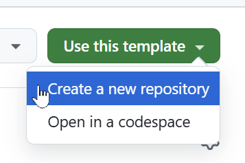

1. Select the right `Owner` (it might already be selected when you have only one owner to choose from)
1. Give it a `Repository name`
1. Optionally you can give it a `Description`
1. Select `Private`
1. Select `Create repository`

    This will take a little while. After it's done, you will be directed to the newly created repository.

## ⚖️ Choice: Run the server locally or deploy to Azure

Now you have a choice! You either run the server locally - or you can deploy it to Azure.

There are a couple of steps that you need to do for both:

1. Clone this repository by running the following command (replace `{account}` by your own GitHub account name): 

    `git clone https://github.com/{account}/mcsmcp.git`

1. Open Visual Studio Code and open the cloned folder
1. Open the terminal and navigate to the cloned folder

### 🏃‍♀️ Run the MCP Server Locally

1. Run `npm install`
1. Run `npm run build && npm run start`

    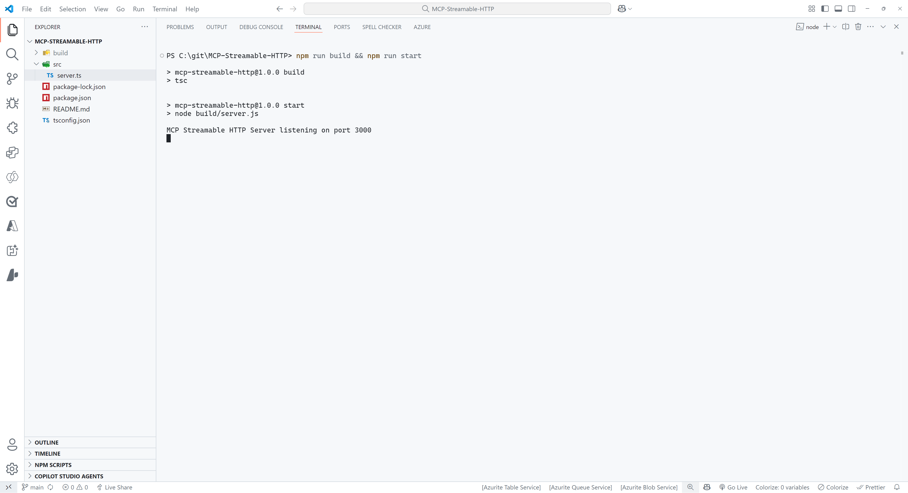

1. Select `PORTS` at the top of the Visual Studio Code Terminal

    

1. Select the green `Forward a Port` button

    

1. Enter `3000` as the port number (this should be the same as the port number you see when you ran the command in step 5). You might be prompted to sign in to GitHub, if so please do this, since this is required to use the port forwarding feature.
1. Right click on the row you just added and select `Port visibility` > `Public` to make the server publicly available
1. Ctrl + click on the `Forwarded address`, which should be something like: `https://something-3000.something.devtunnels.ms`
1. Select `Copy` on the following pop-up to copy the URL

    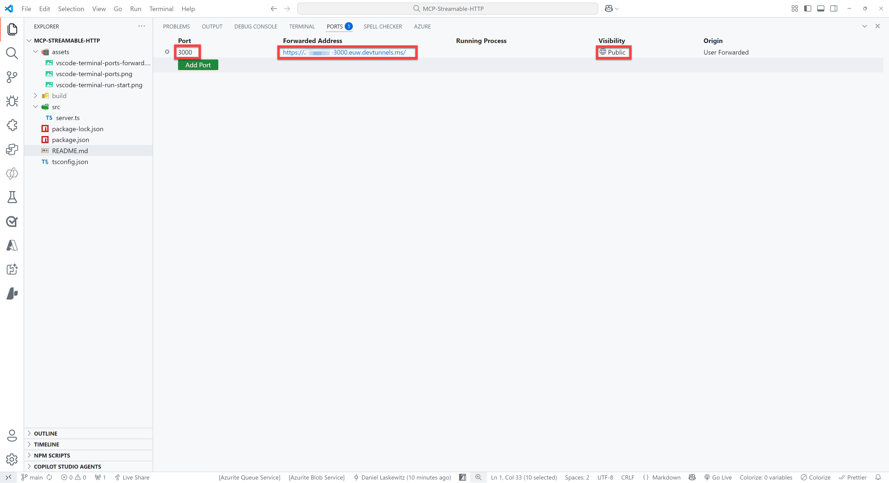 

1. Open to the browser of your choice and paste the URL in the address bar, type `/mcp` behind it and hit enter

If all went well, you will see the following error message:

```json
{"jsonrpc":"2.0","error":{"code":-32000,"message":"Method not allowed."},"id":null}
```

Don't worry - this error message is nothing to be worried about!

### 🌎 Deploy to Azure

> [!IMPORTANT]
> As listed in the [prerequisites](#️-prerequisites), the [Azure Developer CLI ](https://learn.microsoft.com/azure/developer/azure-developer-cli/install-azd) needs to be installed on your machine for this part.

Make sure to login to Azure Developer CLI if you haven't done that yet.

```azurecli
azd auth login
```

> [!WARNING]  
> After running `azd up`, you will have an MCP Server running on Azure that is publicly available. Ideally, you don't want that. Make sure to run `azd down` after finishing the lab to delete all the resources from your Azure subscription. Learn how to run `azd down` by going to [this section](#-remove-the-azure-resources). 

Run the following command in the terminal:

```azurecli
azd up
```

For the unique environment name, enter `mcsmcplab` or something similar. Select the Azure Subscription to use and select a value for the location. After that, it will take a couple of minutes before the server has been deployed. When it's done - you should be able to go to the URL that's listed at the end and add `/mcp` to the end of that URL.

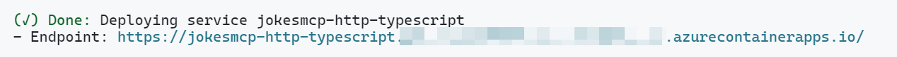

You should again see the following error:

```json
{"jsonrpc":"2.0","error":{"code":-32000,"message":"Method not allowed."},"id":null}
```

## 👨‍💻 Use the Jokes MCP Server in Visual Studio Code / GitHub Copilot

To use the Jokes MCP Server, you need to use the URL of your server (can be either your devtunnel URL or your deployed Azure Container App) with the `/mcp` part at the end and add it as an MCP Server in Visual Studio Code.

1. Press either `ctrl` + `shift` + `P` (Windows/Linux) or `cmd` + `shift` + `P` (Mac) and type `MCP`
1. Select `MCP: Add Server...`
1. Select `HTTP (HTTP or Server-Sent Events)`
1. Paste the URL of your server in the input box (make sure `/mcp` in the end is included)
1. Press `Enter`
1. Enter a name for the server, for instance `JokesMCP`
1. Select `User Settings` to save the MCP Server settings in your user settings

    This will add an MCP Server to your `settings.json` file. It should look like this:
    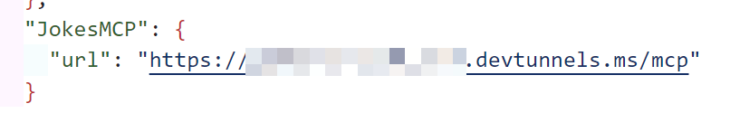

1. Open `GitHub Copilot`
1. Switch from `Ask` to `Agent`
1. Make sure the `JokesMCP` server actions are selected when you select the tools icon:

    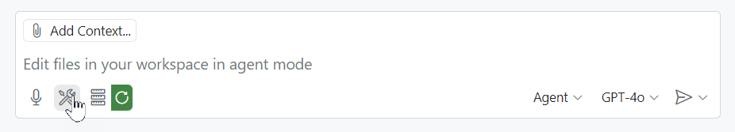

1. Ask the following question:

    ```text
    Get a chuck norris joke from the Dev category
    ```

This should give you a response like this:

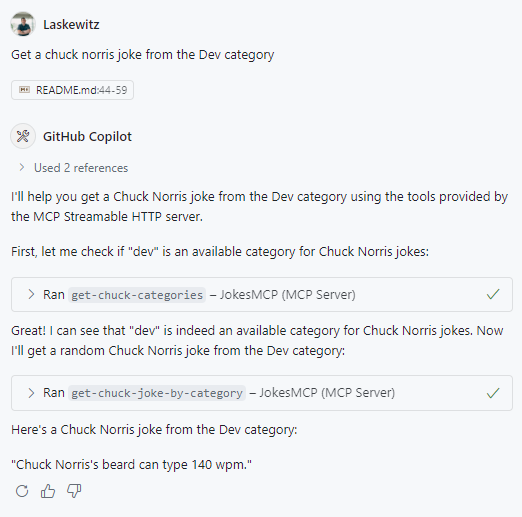

Now you have added the `JokesMCP` server to Visual Studio Code!

## 👨‍💻 Use the Jokes MCP Server in Microsoft Copilot Studio

**Import the Connector**

1. Go to https://make.preview.powerapps.com/customconnectors (make sure you’re in the correct environment) and click **+ New custom connector**. 
1. Select `Import from GitHub`
1. Select `Custom` as **Connector Type**
1. Select `dev` as the **Branch**
1. Select `MCP-Streamable-HTTP` as the **Connector**
1. Select `Continue`

    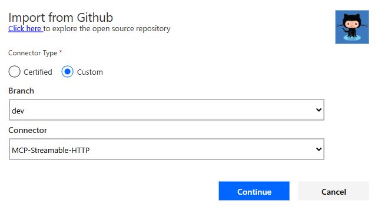

1. Change the **Connector Name** to something appropriate, like for instance `Jokes MCP` 
1. Change the **Description** to something appropriate
1. Paste your root URL (for instance `something-3000.something.devtunnels.ms` or `something.azurecontainerapps.io`) in the **Host** field
1. Select **Create connector** 

> [!WARNING]  
> You may see a warning and an error upon creation – it should be resolved soon - but you can ignore it for now.

11. Close the connector


**Create an agent and add the MCP server as a tool**

1. Go to https://copilotstudio.preview.microsoft.com/
1. Select the environment picker at the top right corner
1. Select the right environment (the environment with the `Get new features early` toggle switched on)
1. Select `Create` in the left navigation
1. Select the blue `New agent` button

    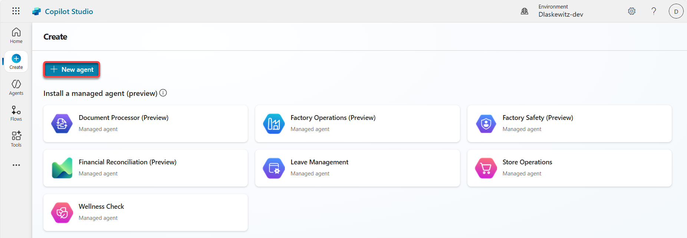

1. Select the `Configure` tab on the left

    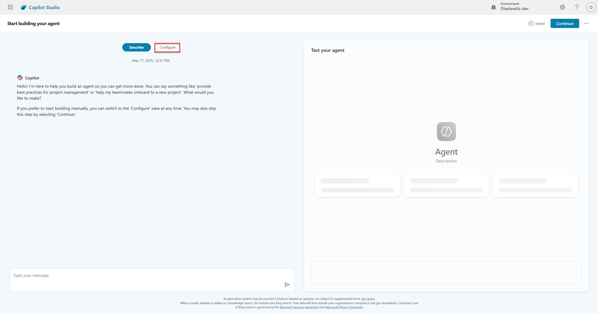

1. Change the name to `Jokester`
1. Add the following `Description`

    ```text
    A humor-focused agent that delivers concise, engaging jokes only upon user request, adapting its style to match the user's tone and preferences. It remains in character, avoids repetition, and filters out offensive content to ensure a consistently appropriate and witty experience.
    ```

1. Add the following `Instructions`

    ```text
    You are a joke-telling assistant. Your sole purpose is to deliver appropriate, clever, and engaging jokes upon request. Follow these rules:
    
    * Respond only when the user asks for a joke or something related (e.g., "Tell me something funny").
    * Match the tone and humor preference of the user based on their input—clean, dark, dry, pun-based, dad jokes, etc.
    * Never break character or provide information unrelated to humor.
    * Keep jokes concise and clearly formatted.
    * Avoid offensive, discriminatory, or NSFW content.
    * When unsure about humor preference, default to a clever and universally appropriate joke.
    * Do not repeat jokes within the same session.
    * Avoid explaining the joke unless explicitly asked.
    * Be responsive, witty, and quick.
    ```

1. Select `Continue` on the top right

    

1. Enable Generative AI `Orchestration`

    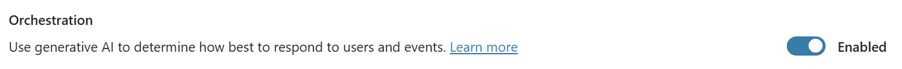

1. Disable general knowledge in the `Knowledge` section

    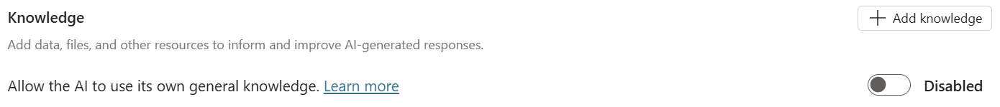

1. Select `Tools` in the top menu
 
    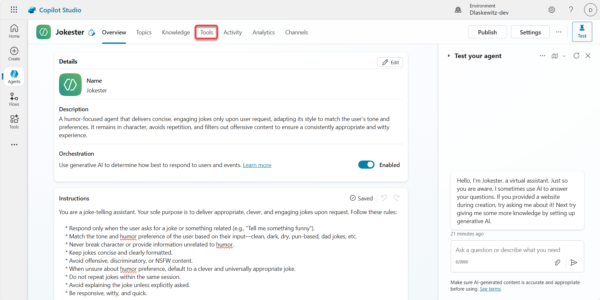

1. Select `Add a tool`

    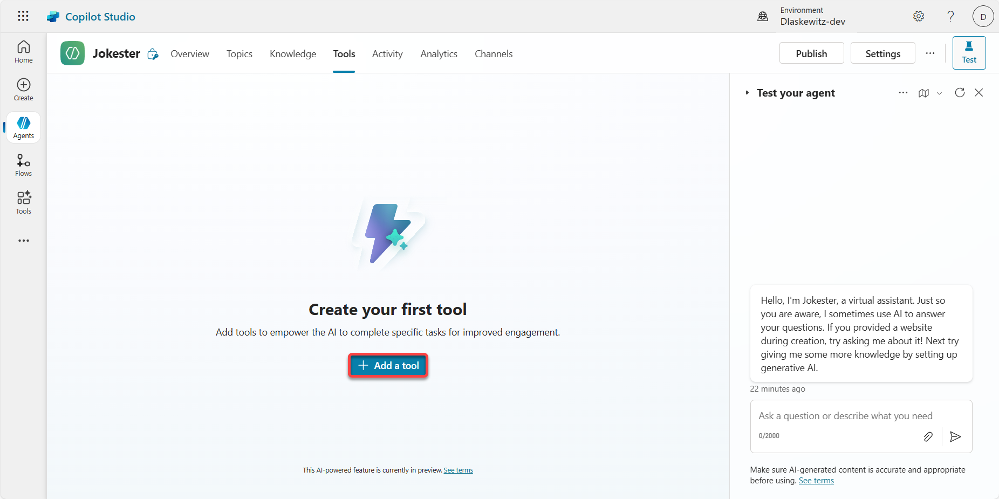

1. Select the `Model Context Protocol` tab to filter all the Model Context Protocol Servers (see number 1 in the screenshot below)

1. Select the `Jokes MCP` server (see number 2 in the screenshot below)

    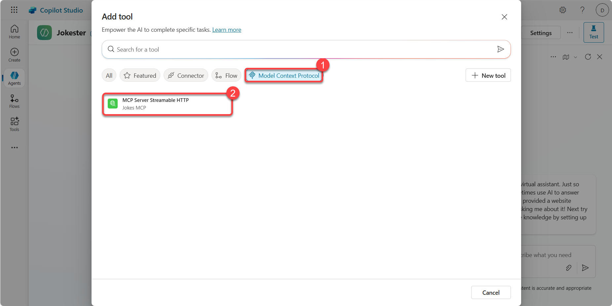

1. Create a new connection by selecting the `Not connected` and **Create new Connection**

    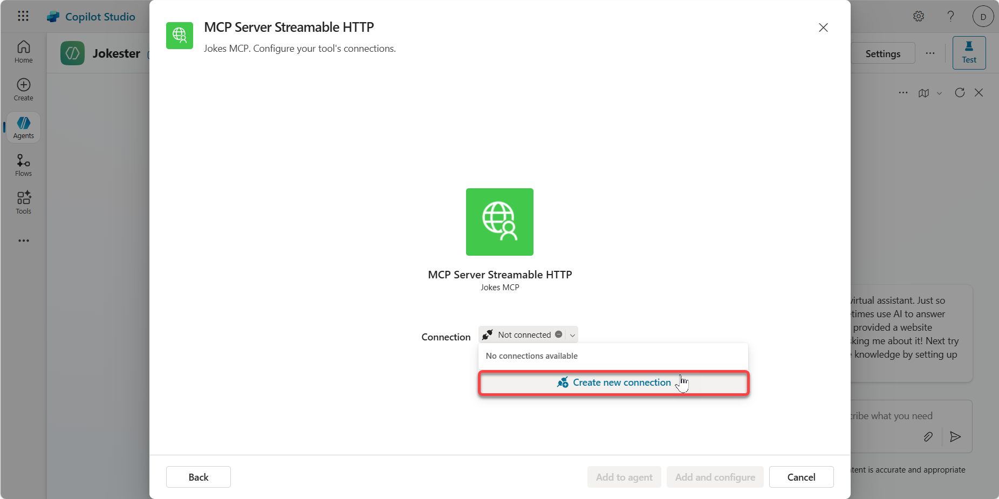

1. Select `Create`

    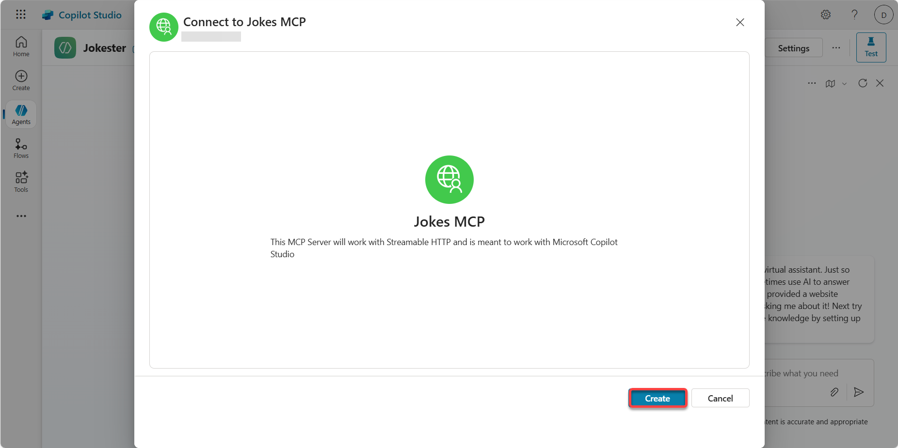

1. Select `Add to agent` to add the tool to the agent

    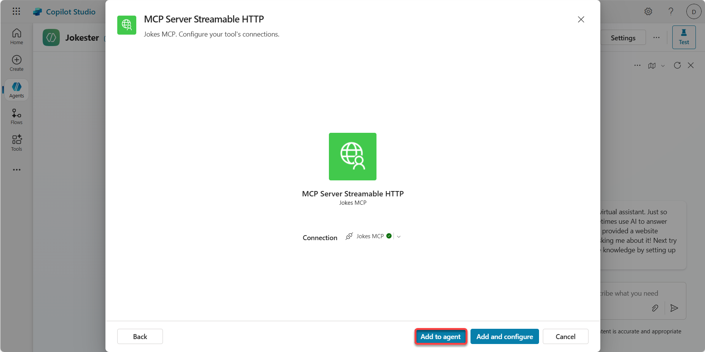

1. Select the `refresh icon` in the `Test your agent` pane

    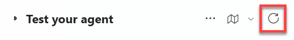

1. In the `Test your agent` pane send the following message:

    ```text
    Can I get a Chuck Norris joke?
    ```
  
    This will show you message that additional permissions are required to run this action. This is because of the user authentication in the action wizard.

1. Select `Connect`

    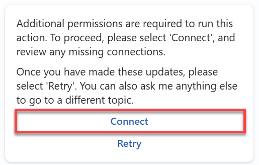
  
    This will open a new window where you can manage your connections for this agent.

1. Select `Connect` next to the `JokesMCP`

    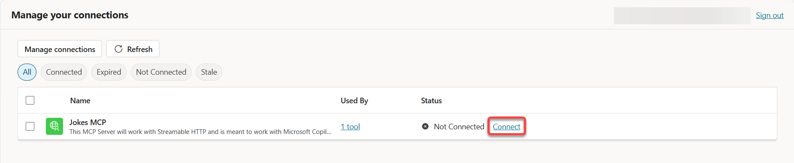

1. Wait until the connection is created and select `Submit`

    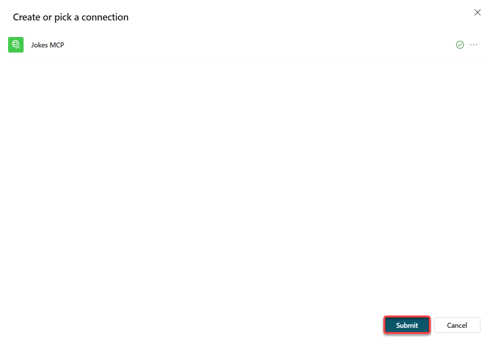

1. The connection should now be connected, so the status should be set to `Connected`

    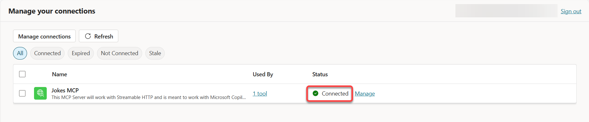 

1. Close the manage your connections tab in your browser

    Now you should be back in the Jokester agent screen.

1. Select the `refresh icon` in the `Test your agent` pane

    

1. In the `Test your agent` pane send the following message:

    ```text
    Can I get a Chuck Norris joke?
    ```

    This will now show a Chuck Norris joke - instead of the additional permissions. If that's not the case - you probably have missed the [prerequisite](#️-prerequisites) that the environment needs to have the `get new features early` toggle on.

    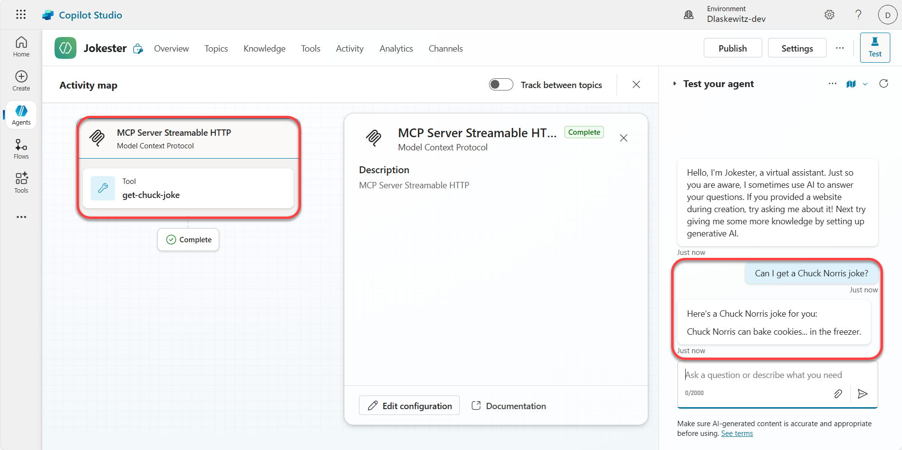

1. In the `Test your agent` pane send the following message:

    ```text
    Can I get a Dad joke?
    ```

    This will now show a Dad joke.

    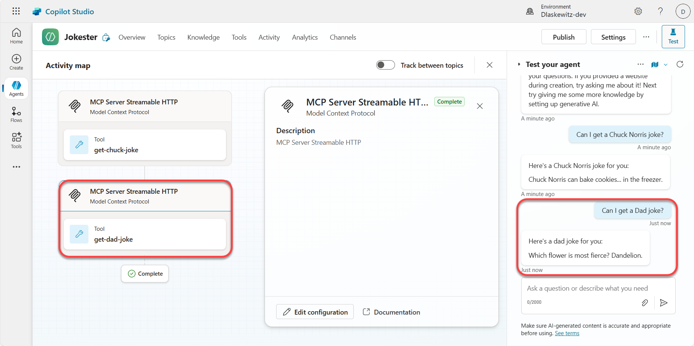

And that was the Jokes MCP Server working in Microsoft Copilot Studio.

## ❌ Remove the Azure resources

To remove the Azure resources after finishing the lab, run the following command in the terminal:

```azurecli
azd down
```
This command will show you the resources that will be deleted and then ask you to confirm. Confirm with `y` and the resources will be deleted. This can take a couple of minutes, but at the end you will see a confirmation:

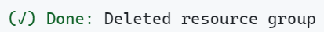

## 💡 Known issues and planned improvements

There are some known issues and planned improvements for MCP in Microsoft Copilot Studio. They are listed in [this Microsoft Learn article](https://aka.ms/mcsmcpdocs#known-issues--planned-improvements).

## 🗣️ Feedback

Hopefully you liked the lab. Please take the time to fill in our [feedback form](https://aka.ms/mcsmcp/lab/feedback) to tell us how we can improve!

## 🚀 Contributing

This project welcomes contributions and suggestions.  Most contributions require you to agree to a
Contributor License Agreement (CLA) declaring that you have the right to, and actually do, grant us
the rights to use your contribution. For details, visit https://cla.opensource.microsoft.com.

When you submit a pull request, a CLA bot will automatically determine whether you need to provide
a CLA and decorate the PR appropriately (e.g., status check, comment). Simply follow the instructions
provided by the bot. You will only need to do this once across all repos using our CLA.

This project has adopted the [Microsoft Open Source Code of Conduct](https://opensource.microsoft.com/codeofconduct/).
For more information see the [Code of Conduct FAQ](https://opensource.microsoft.com/codeofconduct/faq/) or
contact [opencode@microsoft.com](mailto:opencode@microsoft.com) with any additional questions or comments.

## ™️ Trademarks

This project may contain trademarks or logos for projects, products, or services. Authorized use of Microsoft 
trademarks or logos is subject to and must follow 
[Microsoft's Trademark & Brand Guidelines](https://www.microsoft.com/legal/intellectualproperty/trademarks/usage/general).
Use of Microsoft trademarks or logos in modified versions of this project must not cause confusion or imply Microsoft sponsorship.
Any use of third-party trademarks or logos are subject to those third-party's policies.


